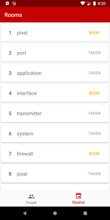

# Directory exercise

This app displays staff and rooms. The employees are sorted alphabetically and if tapped, it opens a detailed page. I pretended not all the data was accessible and I needed another call to download the extra data.

  

## 📐 Architecture

The app was written in Kotlin instead of Java, I think it shows more about my knowledge and it makes working with background threads easier. Both languages can be combined in a project so I found no reason to limit myself to use Java.

The followed architecture pattern is MVVM and a few Jetpack components were used as well:

* Data Binding: populate information on screen
* LiveData: react to data changes in the model
* Lifecycle: only make changes when the views are alive

One last Jetpack component was used, but I do not have experience with it, thus, it contains lots of code from demos online. It seemed appropriate to use the Navigation component because of the nature of the app. It shows data in lists and it will rely on more screens to show the data or book rooms (e.g. show availabilities etc.)

Regarding accessing the data, it is all hidden behind the Repository Pattern, which makes it easier to add multiple sources in the future, and it's accessed through Coroutines. Last, Dependency Injection to allow easier testing of components.

## 📒 Notes

* *Build Flavours* used to target different APIs 
* Brand color was set at theme level so it's easily changeable
* Tablet and landscape designs are done similarly , so I did the latter with the person detail page 

## ⌨️Libraries

- [Retrofit](https://github.com/square/retrofit)
- [LiveData](https://developer.android.com/topic/libraries/architecture/livedata)
- [Coroutines](https://developer.android.com/kotlin/coroutines)
- [Data Binding](https://developer.android.com/topic/libraries/data-binding)
- [Navigation](https://developer.android.com/guide/navigation)
- [Glide](https://github.com/bumptech/glide)

## 📈 Future improvements

* Add unit tests and instrumentation tests
* Add [Paging](https://developer.android.com/topic/libraries/architecture/paging) to smoothen the data loading
* Pick a better `colorAccent` than mine
* Add tablet layouts
* Consider using a Dependency Injection library (e.g. [Dagger 2](https://github.com/google/dagger))